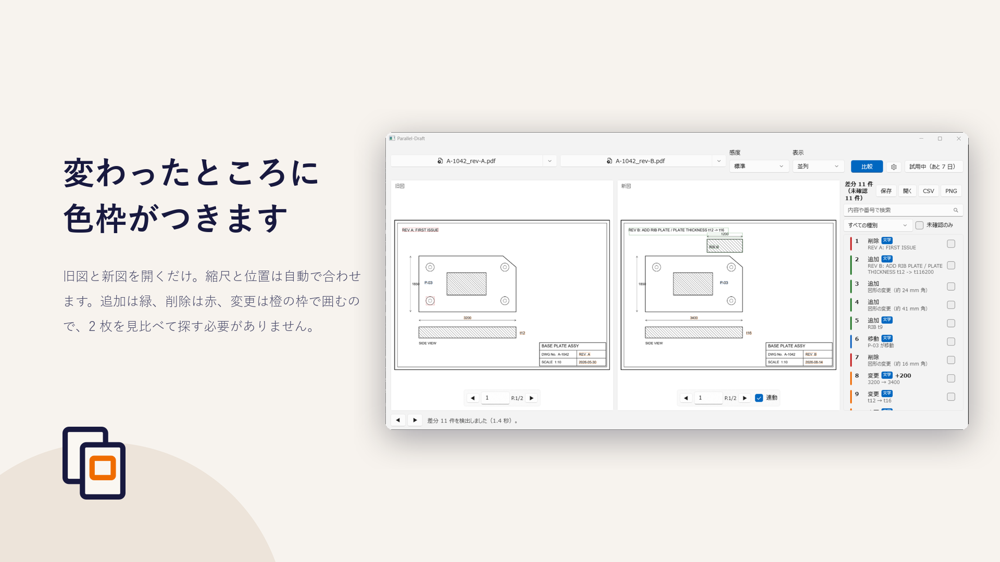
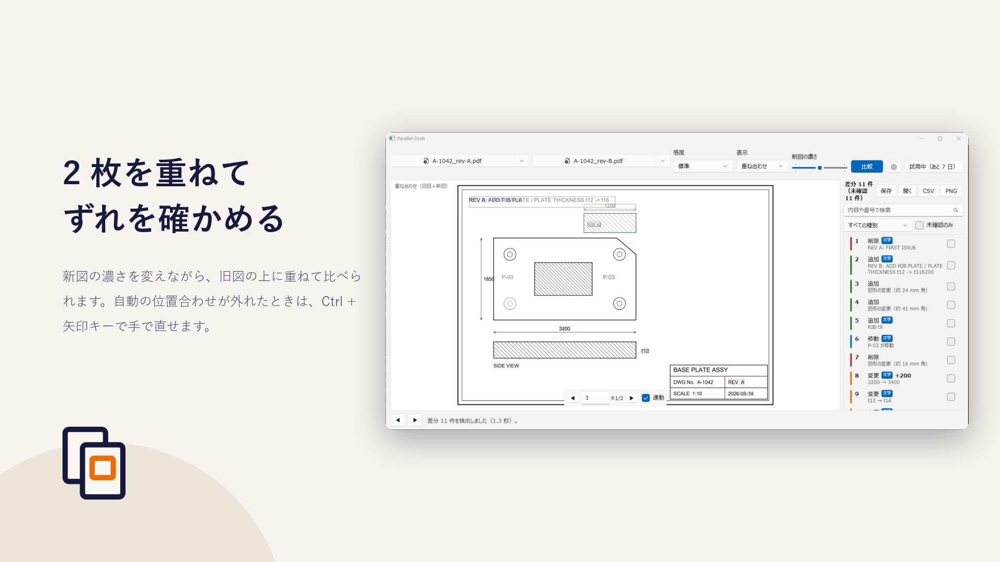
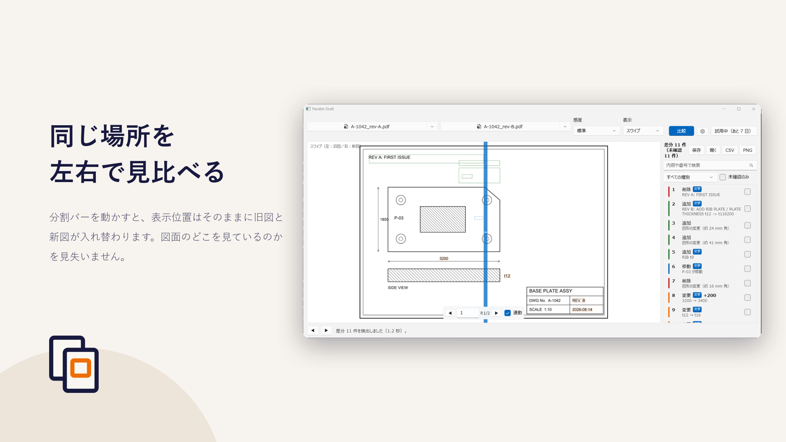
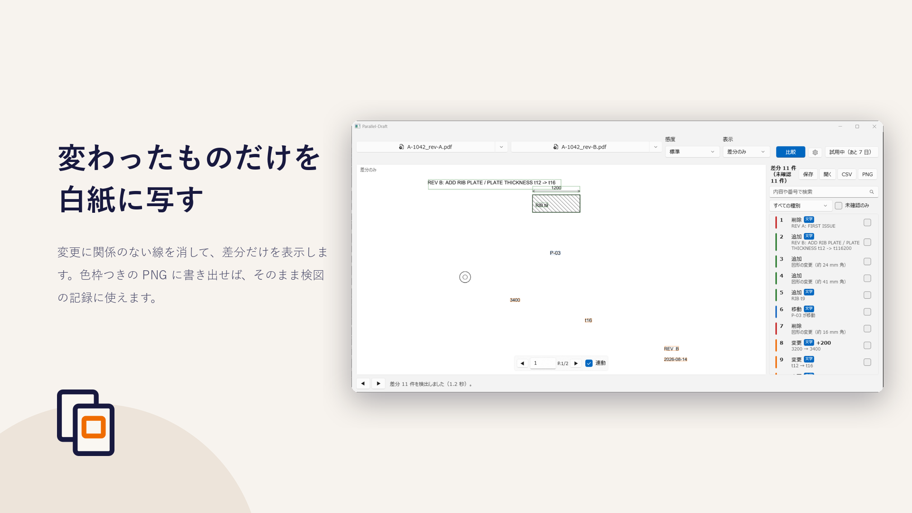

# Parallel-Draft

2 つの PDF 図面を並べて、**変更箇所を色枠で囲んで**示す Windows デスクトップアプリです。

改訂図が届いたときの「前の版とどこが違うのか」を、2 枚を見比べて探す作業から解放します。
図面はすべてお使いの PC の中だけで処理し、外部には送信しません。

- プライバシーポリシー：<https://msmsrep.github.io/Parallel-Draft/privacy/>
- お問い合わせ：<https://github.com/msmsrep/Parallel-Draft/issues>

> このリポジトリには、利用者向けの案内とプライバシーポリシーだけを置いています。
> ソースコードは公開していません。

## 画面

| 並列 | 重ね合わせ |
| --- | --- |
|  |  |

| スワイプ | 差分のみ |
| --- | --- |
|  |  |

## できること

- 2 つの PDF を開くと、縮尺と位置を自動で合わせて比較します
- 変更箇所を色枠で囲みます（追加＝緑、削除＝赤、変更＝橙）
- 4 つの表示モード ― 並列・重ね合わせ・スワイプ・差分のみ
- ページ数が違う図面でも、任意のページ同士を選んで比較できます
- 比較の感度を 3 段階から選べます
- 色枠つきの PNG として書き出せます
- 自動の位置合わせがずれたときは、`Ctrl + 矢印キー` で手で直せます
- 色に頼らずに差分の種別を見分けられる表示（線種で区別）にも切り替えられます
- A0 / A1 の大判図面も、画面に見えている範囲だけを描くので待たされません

## Pro について

インストールから 7 日間は、次の機能もお試しいただけます。

- 図面内の文字の差分（寸法値の変化を「3200 → 3400」のように数値で表示）
- 差分の一覧（クリックでその箇所へジャンプ、絞り込み・検索・確認済みの記録）
- 差分一覧の CSV 書き出し
- 検図の記録（`.pdiff`）の保存と、続きからの再開
- 表題欄などを比較から外す無視領域の指定
- 線の太さ・色だけの変更の検出

7 日を過ぎると、上の 6 つは使えなくなります。続けてお使いになる場合は、
アプリ内から「Parallel-Draft Pro」（買い切り ¥8,000）をご購入ください。
購読ではないので、追加の費用や期限はありません。
同じ Microsoft アカウントであれば、別の PC で買い直す必要もありません。

「できること」に挙げた機能は、購入されなくてもそのままお使いいただけます。
保存済みの検図記録（`.pdiff`）は、7 日を過ぎたあとでも開いて中身を見られます。

## 検出できないもの

図面の比較は万能ではありません。次の変更は、既定の設定では検出できないか、
検出しづらいことがあらかじめ分かっています。

- 線の太さだけが変わった場合（変化が 2〜3 px 以下のとき）
- 色だけが変わった場合（比較は白黒に直してから行うため）
- 小さな文字の変更（画面上で 30 px 程度より小さい文字。実際の図面の寸法値が該当します）
  ※Pro の文字差分機能では検出できます
- 実線から破線への変更（破線の隙間が「削除」として出ます）
- ハッチングの密度の変更（範囲全体が差分として出やすくなります）
- PDF のレイヤ（表示・非表示）の違い

**検図の最後の確認をこのアプリだけに委ねないでください。**
変更箇所を見落としにくくするための道具として作っています。

## 動作環境

- Windows 10 バージョン 1809（10.0.17763）以降
- 64 ビット（x64）。ARM64 の PC でも動作します
- PDF 形式の図面（スキャンした画像だけの図面は、文字の差分を取り出せません）

## 図面は PC から出ません

読み込んだ図面も、比較の結果も、外部に送信しません。利用状況の収集（テレメトリ）も行いません。
ネットワークにつながるのは Microsoft Store のライセンス確認のときだけです。
くわしくは[プライバシーポリシー](https://msmsrep.github.io/Parallel-Draft/privacy/)をご覧ください。

---

© 2026 msmsrep
