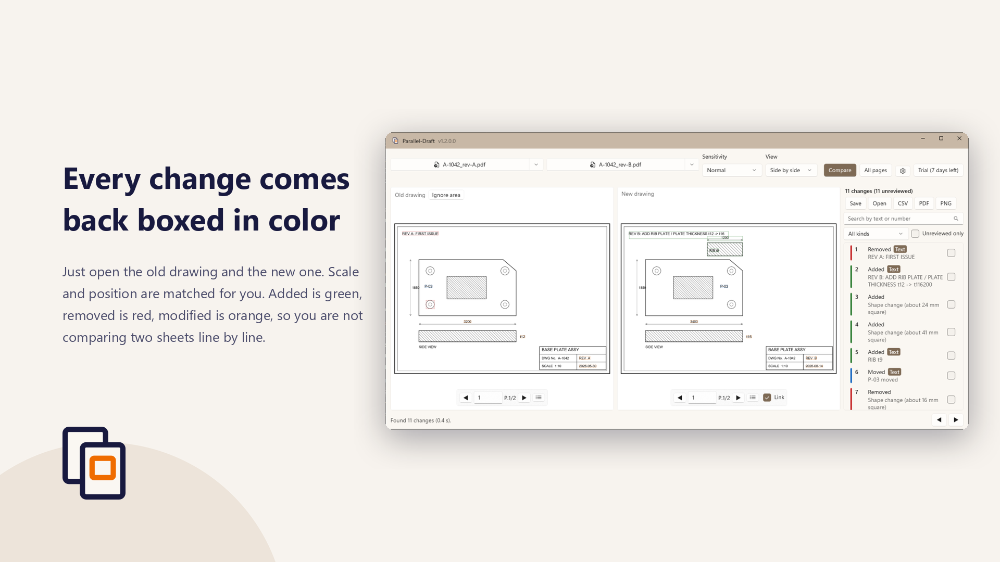
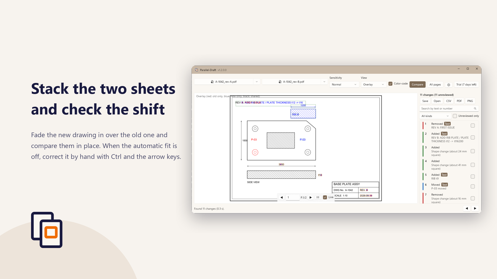
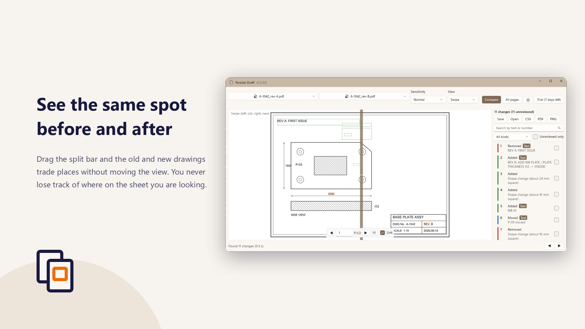
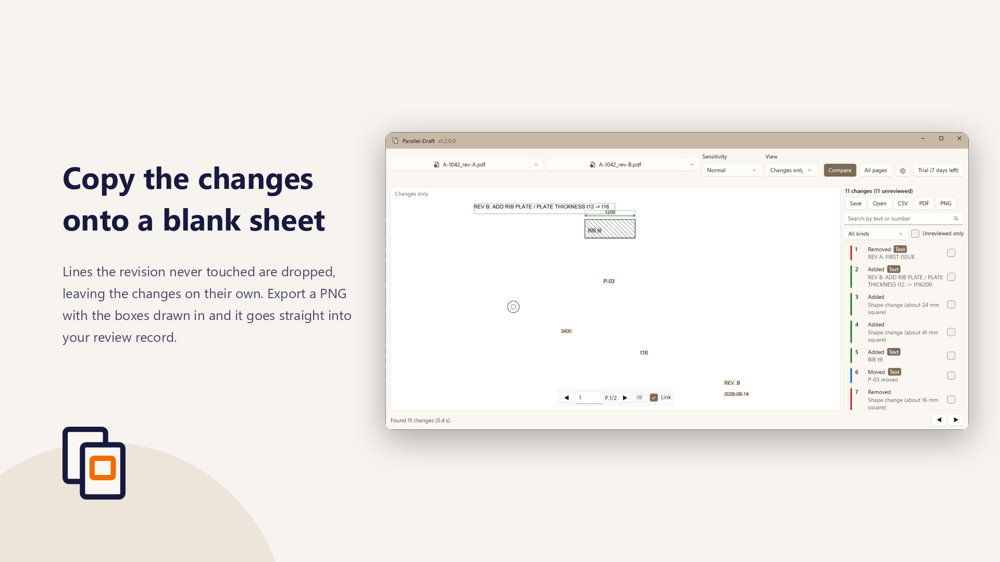

# Parallel-Draft — compare two PDF drawings and box the changes

{: .lead}
A revised drawing arrives, and the question is always the same: what changed since the last
revision? Parallel-Draft takes that pass off your hands. Open the old and the new PDF, and
**every change is boxed in color**. No CAD application and no source files are needed.
Drawings are processed entirely on your own PC and are never sent anywhere.

[Get it from the Microsoft Store](https://apps.microsoft.com/detail/9NJL8DM3KLFB){: .store-link}

  <figure>
    
    <figcaption>Side by side — the two sheets next to each other, scrolling together</figcaption>
  </figure>
  <figure>
    
    <figcaption>Overlay — old in red, new in blue, combined into one sheet</figcaption>
  </figure>
  <figure>
    
    <figcaption>Swipe — drag the divider to flip between old and new in place</figcaption>
  </figure>
  <figure>
    
    <figcaption>Changes only — everything that did not change is dropped</figcaption>
  </figure>

## When you would reach for it

- **A revision just arrived** and the change log you were given does not say where it landed
- **Checking a drawing** and you do not want a small change to slip past you
- **Reconciling a client's drawing against your own**, with nothing but PDFs on hand
- **Recording what changed**, as an annotated PDF or a list you can hand to someone else

## Pricing

Parallel-Draft is free to download. The features under "What it does" are included at no charge.
The features under "What Pro adds" require the **Parallel-Draft Pro** in-app add-on
(one-time purchase, ¥8,000). They can be tried for 7 days after installation; after that they
require the purchase.

## What it does

- Opens two PDFs and **lines them up automatically**, matching scale and position
- Boxes each change in color (added = green, removed = red, modified = orange)
- Four view modes — side by side, overlay, swipe, and changes only
- Compare any two pages, even when the drawings have different page counts
- Three sensitivity presets
- Export the current page as a **PNG** with the boxes drawn in
- Correct the alignment by hand with `Ctrl + arrow keys` when the automatic fit is off
- Tell the change kinds apart without relying on color (they differ by line style too)
- **A0 and A1 sheets** stay responsive: only the part you are looking at is drawn

## What Pro adds

For 7 days after installation you can also try:

- **Text differences inside the drawing** — a dimension change shown as "3200 → 3400"
- **The change list** — click to jump to a change, filter, search, and tick off what you reviewed
- **CSV export** of the change list
- **Annotated PDF export** (colored boxes, numbers, and a summary page)
- **Compare every page at once**, with pages matched by drawing number
- **Saved review records** (`.pdiff`) you can reopen and continue
- **Ignore areas**, so a title block does not show up as a change every time
- Detection of changes in line weight or color alone

After 7 days those features stop. To keep using them, buy "Parallel-Draft Pro" from inside the
app. It is a one-time purchase (¥8,000), not a subscription, so there are no further charges and
no expiry. The same Microsoft account does not have to buy it again on another PC.

Saved review records (`.pdiff`) can still be opened and read after the 7 days are up.

## What it cannot detect

Comparing drawings is not infallible. The following changes are known in advance to be
undetectable, or hard to detect, with the default settings.

- A change in line weight alone, when the difference is about 2–3 px or less
- A change in color alone (the comparison converts to black and white first)
- Small text changes (text below roughly 30 px on screen, which is where real dimension values
  land) — Pro's text comparison does find these
- A solid line changed to a dashed line (the gaps show up as "removed")
- A change in hatch density (the whole area tends to come out as one change)
- Differences in PDF layers (shown or hidden)

**Please do not let this app be the last check in your review.**
It is built to make a missed change less likely, not to remove the need to look.

## Your drawings stay on your PC

Neither the drawings you open nor the comparison results are sent anywhere. No usage data is
collected. The only time this app reaches the network is to verify your Microsoft Store license.
Crash records stay on your PC and are never transmitted.

The [privacy policy](../privacy/) has the details (Japanese).

## System requirements

- Windows 10 version 1809 (10.0.17763) or later
- 64-bit (x64). Runs on ARM64 PCs as well
- PDF drawings (a scanned image-only drawing has no text to compare)
- The interface is available in Japanese and English, following your Windows display language

## Frequently asked questions

### Is it free?

Parallel-Draft is free to download, and comparing two PDFs, the colored boxes, and PNG export are
included at no charge. Text differences, the change list, CSV and annotated PDF export, and
all-page comparison require the "Parallel-Draft Pro" in-app add-on (one-time purchase, ¥8,000).
They can be tried for 7 days after installation.

### Do I need the CAD files (DWG / DXF)?

No. The comparison works from the PDFs alone. You need neither a CAD application nor access to
the source data, so drawings a client sent you as PDFs can be compared as they are.

### Does it work on scanned drawings?

Shape differences are detected. An image-only PDF has no text to extract, so the text comparison
that reports a dimension change as a number does not apply.

### Are my drawings ever uploaded?

No. The drawings you open and the comparison results stay on your PC. No usage data is collected.
The only time the app reaches the network is to verify your Microsoft Store license.

### Can it compare drawings with different page counts or sheet sizes?

Yes. Scale and position are matched automatically. When the page counts differ you can pick any
two pages, and Pro matches pages by drawing number to compare every page at once.

### Is it a subscription? Can I use it on another PC?

It is not a subscription. Pro is a one-time purchase (¥8,000) with no further charges and no
expiry. The same Microsoft account does not have to buy it again on another PC.

### Is the source code available?

No. The [GitHub repository](https://github.com/msmsrep/Parallel-Draft) holds only this page and
the privacy policy. Bug reports and requests are welcome in
[Issues](https://github.com/msmsrep/Parallel-Draft/issues).

---

[Get it from the Microsoft Store](https://apps.microsoft.com/detail/9NJL8DM3KLFB){: .store-link}
