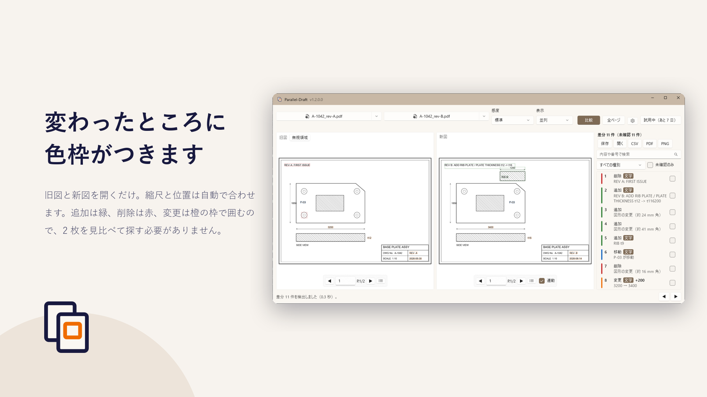
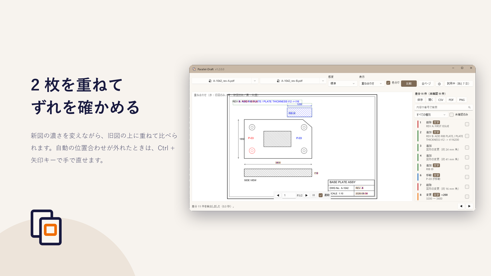
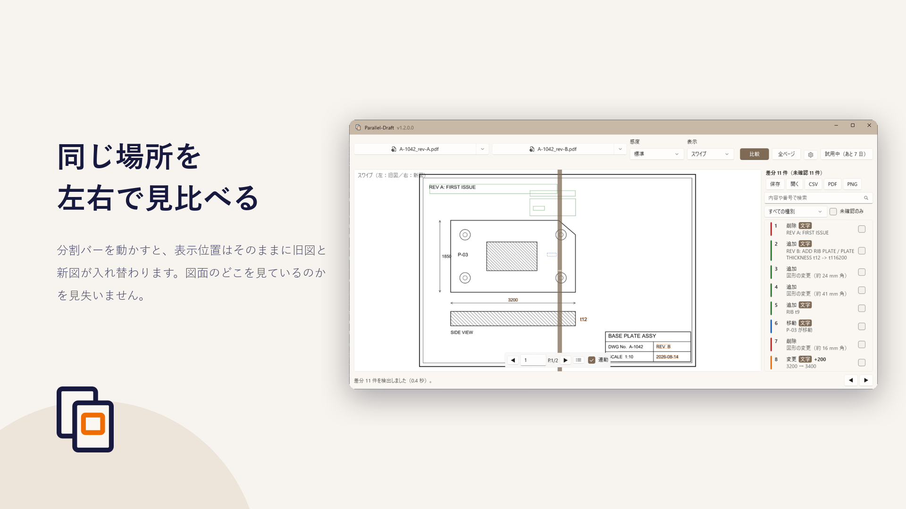
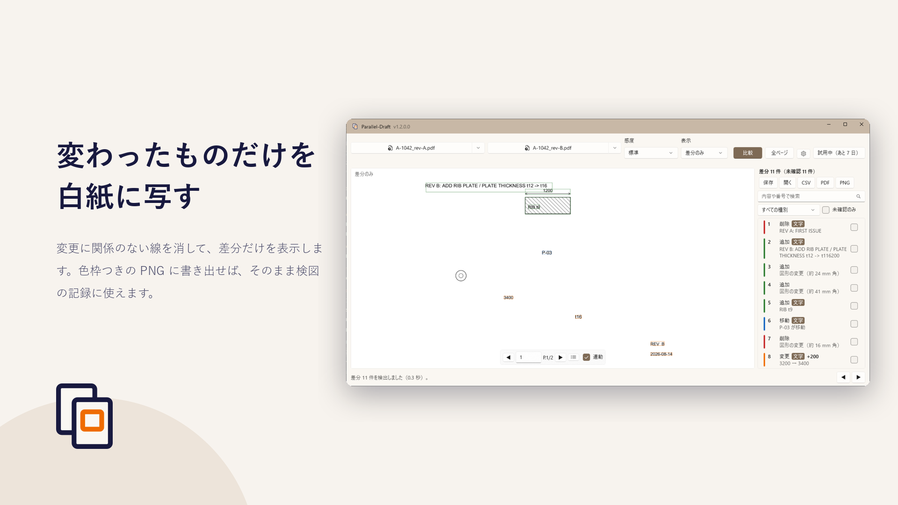

# Parallel-Draft — 2 つの PDF 図面を比較し、変更箇所を色枠で示す

{: .lead}
改訂図が届いたときの「前の版とどこが違うのか」。
2 枚を並べて目で追う作業を、Parallel-Draft が引き受けます。
旧図と新図の PDF を開くだけで、**変更箇所を色枠で囲んで**示します。
CAD ソフトも元データも要りません。図面はすべてお使いの PC の中だけで処理し、外部には送信しません。

[Microsoft Store で入手する](https://apps.microsoft.com/detail/9NJL8DM3KLFB){: .store-link}

  <figure>
    
    <figcaption>並列 — 旧図と新図を左右に並べ、同じ位置を連動してスクロール</figcaption>
  </figure>
  <figure>
    
    <figcaption>重ね合わせ — 旧図＝赤・新図＝青のチャンネル合成で 1 枚に重ねる</figcaption>
  </figure>
  <figure>
    
    <figcaption>スワイプ — 境界を動かして、同じ場所の旧図と新図を見比べる</figcaption>
  </figure>
  <figure>
    
    <figcaption>差分のみ — 変わった箇所だけを残して表示する</figcaption>
  </figure>

## こんなときに

- **改訂図が届いた。** どこが変わったのか、先方の変更履歴だけでは分からない
- **検図で変更箇所を拾う。** 2 枚を見比べる作業で、小さな変更を見落としたくない
- **客先支給図と自社図を照合する。** 元データはなく、手元にあるのは PDF だけ
- **変更箇所を記録として残す。** 何が変わったのかを、色枠つきの PDF や一覧で第三者に渡したい

## 料金

アプリ本体は無料でダウンロードできます。下の「できること」に挙げた機能は追加料金なしで使えます。
「Pro でできること」に挙げた機能は、アプリ内アドオン「**Parallel-Draft Pro**」（買い切り・¥8,000）の購入が必要です。
インストールから 7 日間はお試しいただけますが、その後は購入が必要になります。

## できること

- 2 つの PDF を開くと、**縮尺と位置を自動で合わせて**比較します
- 変更箇所を色枠で囲みます（追加＝緑、削除＝赤、変更＝橙）
- 4 つの表示モード ― 並列・重ね合わせ・スワイプ・差分のみ
- ページ数が違う図面でも、任意のページ同士を選んで比較できます
- 比較の感度を 3 段階から選べます
- 色枠つきの **PNG** として書き出せます
- 自動の位置合わせがずれたときは、`Ctrl + 矢印キー` で手で直せます
- 色に頼らずに差分の種別を見分けられる表示（線種で区別）にも切り替えられます
- **A0 / A1 の大判図面**も、画面に見えている範囲だけを描くので待たされません

## Pro でできること

インストールから 7 日間は、次の機能もお試しいただけます。

- **図面内の文字の差分** — 寸法値の変化を「3200 → 3400」のように数値で表示
- **差分の一覧** — クリックでその箇所へジャンプ。絞り込み・検索・確認済みの記録
- 差分一覧の **CSV** 書き出し
- **注釈付き PDF** の書き出し（色枠・連番・まとめのページつき）
- **全ページの一括比較**（ページの対応は図面番号から自動で付けます）
- **検図の記録**（`.pdiff`）の保存と、続きからの再開
- 表題欄などを比較から外す**無視領域**の指定
- 線の太さ・色だけの変更の検出

7 日を過ぎると、上の機能は使えなくなります。続けてお使いになる場合は、
アプリ内から「Parallel-Draft Pro」（買い切り ¥8,000）をご購入ください。
購読ではないので、追加の費用や期限はありません。
同じ Microsoft アカウントであれば、別の PC で買い直す必要もありません。

保存済みの検図記録（`.pdiff`）は、7 日を過ぎたあとでも開いて中身を見られます。

## 検出できないもの

図面の比較は万能ではありません。次の変更は、既定の設定では検出できないか、
検出しづらいことがあらかじめ分かっています。

- 線の太さだけが変わった場合（変化が 2〜3 px 以下のとき）
- 色だけが変わった場合（比較は白黒に直してから行うため）
- 小さな文字の変更（画面上で 30 px 程度より小さい文字。実際の図面の寸法値が該当します）
  ※Pro の文字差分機能では検出できます
- 実線から破線への変更（破線の隙間が「削除」として出ます）
- ハッチングの密度の変更（範囲全体が差分として出やすくなります）
- PDF のレイヤ（表示・非表示）の違い

**検図の最後の確認をこのアプリだけに委ねないでください。**
変更箇所を見落としにくくするための道具として作っています。

## 図面は PC から出ません

読み込んだ図面も、比較の結果も、外部に送信しません。利用状況の収集（テレメトリ）も行いません。
ネットワークにつながるのは Microsoft Store のライセンス確認のときだけです。
クラッシュの記録はお使いの PC の中だけに残り、送信されません。

くわしくは[プライバシーポリシー](privacy/)をご覧ください。

## 動作環境

- Windows 10 バージョン 1809（10.0.17763）以降
- 64 ビット（x64）。ARM64 の PC でも動作します
- PDF 形式の図面（スキャンした画像だけの図面は、文字の差分を取り出せません）
- 表示は日本語と英語。Windows の表示言語に合わせて切り替わります

## よくある質問

### 無料で使えますか

アプリ本体は無料でダウンロードでき、2 つの PDF の比較・色枠表示・PNG 書き出しは追加料金なしで使えます。
文字差分・差分リスト・CSV と注釈付き PDF の書き出し・全ページ一括比較などは、アプリ内アドオン
「Parallel-Draft Pro」（買い切り・¥8,000）の購入が必要です。インストールから 7 日間はお試しいただけます。

### CAD データ（DWG / DXF）は必要ですか

必要ありません。PDF だけで比較します。CAD ソフトも、元データへのアクセスも要りません。
客先から PDF で支給された図面同士でも比較できます。

### スキャンした図面でも使えますか

図形の差分は検出できます。ただし画像だけの PDF には取り出せる文字が無いため、
寸法値の変化を数値で示す文字差分は働きません。

### 図面が外部に送信されることはありませんか

ありません。読み込んだ図面も比較の結果も、お使いの PC の中だけで処理されます。
利用状況の収集（テレメトリ）も行いません。
ネットワークにつながるのは Microsoft Store のライセンス確認のときだけです。

### ページ数や用紙サイズが違う図面でも比較できますか

できます。縮尺と位置は自動で合わせます。ページ数が違う場合は任意のページ同士を選んで比較でき、
Pro では図面番号でページを対応付けて全ページを一括比較できます。

### 購読ですか。別の PC でも使えますか

購読ではありません。Pro は買い切り（¥8,000）で、追加の費用も期限もありません。
同じ Microsoft アカウントであれば、別の PC で買い直す必要はありません。

### ソースコードは公開されていますか

公開していません。[GitHub のリポジトリ](https://github.com/msmsrep/Parallel-Draft)には、
この案内とプライバシーポリシーだけを置いています。
不具合のご報告やご要望は [Issues](https://github.com/msmsrep/Parallel-Draft/issues) へお寄せください。

---

[Microsoft Store で入手する](https://apps.microsoft.com/detail/9NJL8DM3KLFB){: .store-link}
